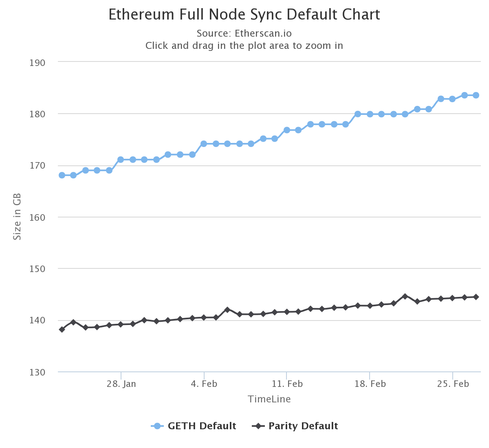

# 永不宕机的服务器 - 以太坊客户端及网络介绍

自从比特币诞生以来，出现过多种分叉、变种、改进，其中不能被忽视的，就是被广泛称为“区块链2.0”的以太坊。

目前以太坊是配套工具最完善的公链，也有很好的技术社区，许多转型区块链开发的技术人员，都是从以太坊开始的。 

本专栏从以太坊配套工具开始介绍，快速过渡到相关实战，用一个贯穿的示例项目，为大家呈现真实场景的以太坊项目开发全貌。

课程会涉及到：

* 合约开发（Solidity）
* DApp开发（JavaScript）
* 中心化服务开发（Go）
* 相关的代码调试技巧

跟随专栏的学习，相信每位同学都能找到自己的切入点，顺利转型到区块链领域，为自己增值加薪，甚至独立完成一款DApp开发，成为区块链行当里炙手可热的全栈高手。

## 一、以太坊是永不宕机的服务器

以太坊之所以被称为“区块链2.0”，主要原因是对比特币的区块链概念加入了一个“可以运行图灵完备的编程语言的虚拟机”，V神称之为“`Smart Contract`”，即“智能合约”。该编程语言就是`Solidity`。以太坊也因此成为了一个智能合约运行平台。


`Solidity`语言编写的智能合约，可以是一段完整逻辑的代码，部署到以太坊上以后，就成为一个单独的服务，而且该服务随时随地都可以访问。

因此，从服务角度上看，以太坊就是一台永不宕机的服务器，而且防攻击的特性非常非常强。

以下是以太坊官网的描述，可以清楚地看到项目对自己的这一层定义。

> Ethereum is a **decentralized platform that runs smart contracts**: applications that run exactly as programmed without any possibility of downtime, censorship, fraud or third-party interference.

## 二、以太坊客户端

以太坊的客户端就是通常说的钱包。跟比特币一样，以太坊钱包通常也是一个全节点，含有所有区块数据，并拥有用户的私钥，用于访问链上资产。

### 2.1 官方钱包 `Ethereum Wallet`

官方钱包仓库地址是[https://github.com/ethereum/mist](https://github.com/ethereum/mist)，最大的特点就是可信、功能完整。这个之前叫做`Mist`的软件集合了帐户管理、转账、合约编写部署等功能，十分强大。


尤其是贴心的智能合约调试、部署和交互功能，非常赞。


但我也说过了，这个钱包是全节点钱包，拥有所有的区块数据，数据量已经到近200G，不容小觑。



### 2.2 `Geth`

官方钱包底层使用的是geth，仓库地址[https://github.com/ethereum/go-ethereum](https://github.com/ethereum/go-ethereum)，这是一个使用Go语言写的全节点客户端，支持命令行操作（亦即CLI程序），具有所有完整的钱包功能。

```text
NAME:
   geth - the go-ethereum command line interface

   Copyright 2013-2017 The go-ethereum Authors

USAGE:
   geth [options] command [command options] [arguments...]

VERSION:
   1.8.2-stable

COMMANDS:
   account     Manage accounts
   attach      Start an interactive JavaScript environment (connect to node)
   bug         opens a window to report a bug on the geth repo
   console     Start an interactive JavaScript environment
   copydb      Create a local chain from a target chaindata folder
   dump        Dump a specific block from storage
   dumpconfig  Show configuration values
   export      Export blockchain into file
   import      Import a blockchain file
   init        Bootstrap and initialize a new genesis block
   js          Execute the specified JavaScript files
   license     Display license information
   makecache   Generate ethash verification cache (for testing)
   makedag     Generate ethash mining DAG (for testing)
   monitor     Monitor and visualize node metrics
   removedb    Remove blockchain and state databases
   version     Print version numbers
   wallet      Manage Ethereum presale wallets
   help, h     Shows a list of commands or help for one command

ETHEREUM OPTIONS:
  --config value                                   TOML configuration file
  --datadir "/Users/xingyongtao/Library/Ethereum"  Data directory for the databases and keystore
  --keystore                                       Directory for the keystore (default = inside the datadir)
  --nousb                                          Disables monitoring for and managing USB hardware wallets
  --networkid value                                Network identifier (integer, 1=Frontier, 2=Morden (disused), 3=Ropsten, 4=Rinkeby) (default: 1)
  --testnet                                        Ropsten network: pre-configured proof-of-work test network
  --rinkeby                                        Rinkeby network: pre-configured proof-of-authority test network
  --syncmode "fast"                                Blockchain sync mode ("fast", "full", or "light")
  --gcmode value                                   Blockchain garbage collection mode ("full", "archive") (default: "full")
  --ethstats value                                 Reporting URL of a ethstats service (nodename:secret@host:port)
  --identity value                                 Custom node name
  --lightserv value                                Maximum percentage of time allowed for serving LES requests (0-90) (default: 0)
  --lightpeers value                               Maximum number of LES client peers (default: 100)
  --lightkdf                                       Reduce key-derivation RAM & CPU usage at some expense of KDF strength

DEVELOPER CHAIN OPTIONS:
  --dev               Ephemeral proof-of-authority network with a pre-funded developer account, mining enabled
  --dev.period value  Block period to use in developer mode (0 = mine only if transaction pending) (default: 0)

ETHASH OPTIONS:
  --ethash.cachedir                             Directory to store the ethash verification caches (default = inside the datadir)
  --ethash.cachesinmem value                    Number of recent ethash caches to keep in memory (16MB each) (default: 2)
  --ethash.cachesondisk value                   Number of recent ethash caches to keep on disk (16MB each) (default: 3)
  --ethash.dagdir "/Users/xingyongtao/.ethash"  Directory to store the ethash mining DAGs (default = inside home folder)
  --ethash.dagsinmem value                      Number of recent ethash mining DAGs to keep in memory (1+GB each) (default: 1)
  --ethash.dagsondisk value                     Number of recent ethash mining DAGs to keep on disk (1+GB each) (default: 2)

TRANSACTION POOL OPTIONS:
  --txpool.nolocals            Disables price exemptions for locally submitted transactions
  --txpool.journal value       Disk journal for local transaction to survive node restarts (default: "transactions.rlp")
  --txpool.rejournal value     Time interval to regenerate the local transaction journal (default: 1h0m0s)
  --txpool.pricelimit value    Minimum gas price limit to enforce for acceptance into the pool (default: 1)
  --txpool.pricebump value     Price bump percentage to replace an already existing transaction (default: 10)
  --txpool.accountslots value  Minimum number of executable transaction slots guaranteed per account (default: 16)
  --txpool.globalslots value   Maximum number of executable transaction slots for all accounts (default: 4096)
  --txpool.accountqueue value  Maximum number of non-executable transaction slots permitted per account (default: 64)
  --txpool.globalqueue value   Maximum number of non-executable transaction slots for all accounts (default: 1024)
  --txpool.lifetime value      Maximum amount of time non-executable transaction are queued (default: 3h0m0s)

PERFORMANCE TUNING OPTIONS:
  --cache value            Megabytes of memory allocated to internal caching (default: 1024)
  --cache.database value   Percentage of cache memory allowance to use for database io (default: 75)
  --cache.gc value         Percentage of cache memory allowance to use for trie pruning (default: 25)
  --trie-cache-gens value  Number of trie node generations to keep in memory (default: 120)

ACCOUNT OPTIONS:
  --unlock value    Comma separated list of accounts to unlock
  --password value  Password file to use for non-interactive password input

API AND CONSOLE OPTIONS:
  --rpc                  Enable the HTTP-RPC server
  --rpcaddr value        HTTP-RPC server listening interface (default: "localhost")
  --rpcport value        HTTP-RPC server listening port (default: 8545)
  --rpcapi value         API's offered over the HTTP-RPC interface
  --ws                   Enable the WS-RPC server
  --wsaddr value         WS-RPC server listening interface (default: "localhost")
  --wsport value         WS-RPC server listening port (default: 8546)
  --wsapi value          API's offered over the WS-RPC interface
  --wsorigins value      Origins from which to accept websockets requests
  --ipcdisable           Disable the IPC-RPC server
  --ipcpath              Filename for IPC socket/pipe within the datadir (explicit paths escape it)
  --rpccorsdomain value  Comma separated list of domains from which to accept cross origin requests (browser enforced)
  --rpcvhosts value      Comma separated list of virtual hostnames from which to accept requests (server enforced). Accepts '*' wildcard. (default: "localhost")
  --jspath loadScript    JavaScript root path for loadScript (default: ".")
  --exec value           Execute JavaScript statement
  --preload value        Comma separated list of JavaScript files to preload into the console

NETWORKING OPTIONS:
  --bootnodes value     Comma separated enode URLs for P2P discovery bootstrap (set v4+v5 instead for light servers)
  --bootnodesv4 value   Comma separated enode URLs for P2P v4 discovery bootstrap (light server, full nodes)
  --bootnodesv5 value   Comma separated enode URLs for P2P v5 discovery bootstrap (light server, light nodes)
  --port value          Network listening port (default: 30303)
  --maxpeers value      Maximum number of network peers (network disabled if set to 0) (default: 25)
  --maxpendpeers value  Maximum number of pending connection attempts (defaults used if set to 0) (default: 0)
  --nat value           NAT port mapping mechanism (any|none|upnp|pmp|extip:<IP>) (default: "any")
  --nodiscover          Disables the peer discovery mechanism (manual peer addition)
  --v5disc              Enables the experimental RLPx V5 (Topic Discovery) mechanism
  --netrestrict value   Restricts network communication to the given IP networks (CIDR masks)
  --nodekey value       P2P node key file
  --nodekeyhex value    P2P node key as hex (for testing)

MINER OPTIONS:
  --mine                    Enable mining
  --minerthreads value      Number of CPU threads to use for mining (default: 4)
  --etherbase value         Public address for block mining rewards (default = first account created) (default: "0")
  --targetgaslimit value    Target gas limit sets the artificial target gas floor for the blocks to mine (default: 4712388)
  --gasprice "18000000000"  Minimal gas price to accept for mining a transactions
  --extradata value         Block extra data set by the miner (default = client version)

GAS PRICE ORACLE OPTIONS:
  --gpoblocks value      Number of recent blocks to check for gas prices (default: 20)
  --gpopercentile value  Suggested gas price is the given percentile of a set of recent transaction gas prices (default: 60)

VIRTUAL MACHINE OPTIONS:
  --vmdebug  Record information useful for VM and contract debugging

LOGGING AND DEBUGGING OPTIONS:
  --metrics                 Enable metrics collection and reporting
  --fakepow                 Disables proof-of-work verification
  --nocompaction            Disables db compaction after import
  --verbosity value         Logging verbosity: 0=silent, 1=error, 2=warn, 3=info, 4=debug, 5=detail (default: 3)
  --vmodule value           Per-module verbosity: comma-separated list of <pattern>=<level> (e.g. eth/*=5,p2p=4)
  --backtrace value         Request a stack trace at a specific logging statement (e.g. "block.go:271")
  --debug                   Prepends log messages with call-site location (file and line number)
  --pprof                   Enable the pprof HTTP server
  --pprofaddr value         pprof HTTP server listening interface (default: "127.0.0.1")
  --pprofport value         pprof HTTP server listening port (default: 6060)
  --memprofilerate value    Turn on memory profiling with the given rate (default: 524288)
  --blockprofilerate value  Turn on block profiling with the given rate (default: 0)
  --cpuprofile value        Write CPU profile to the given file
  --trace value             Write execution trace to the given file

WHISPER (EXPERIMENTAL) OPTIONS:
  --shh                       Enable Whisper
  --shh.maxmessagesize value  Max message size accepted (default: 1048576)
  --shh.pow value             Minimum POW accepted (default: 0.2)

DEPRECATED OPTIONS:
  --fast   Enable fast syncing through state downloads
  --light  Enable light client mode

MISC OPTIONS:
  --help, -h  show help


COPYRIGHT:
   Copyright 2013-2017 The go-ethereum Authors
```

除了这个Go版本的客户端，还有C++、Python等版本的客户端。


### 2.3 其他

其他非官方客户端，还有很多很多，有的是类似`Ethereum Wallet`的全节点的钱包，有的是网页或者网页插件，还有的是硬件钱包或者硬件钱包里的一个App。


## 三、以太坊网络

以太坊作为基础设施，当然会有不同的测试网络供开发者使用，不同于一般的在线服务，区块链是有价值存储功能，因此，还有各种各样的水龙头服务，帮大家免费领取测试网的Ether。

* **主网`Mainnet`**：生产环境，全局唯一，其上运行的合约，会消耗真实以太币`Ether`
* **测试网`Testnet`**：公共测试环境，其上的以太币没有价值，仅用于开发调试
  * **Rinkeby**：以太坊官方提供的测试网络，使用PoA共识机制
  * **Kovan**：以太坊钱包Parity的开发团队提供的测试网络，使用PoA共识机制
  * **Ropsten**：以太坊官方提供的测试网络，使用PoW共识机制
* **私有网**：有权限控制，只限于私人或者私有组织连接的网络
  * 通常接触到的，是在本机运行的开发环境，用来调试

